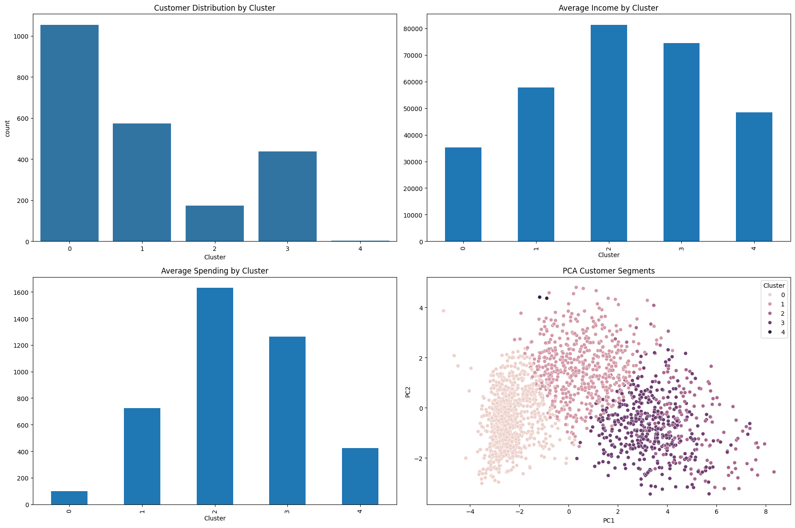
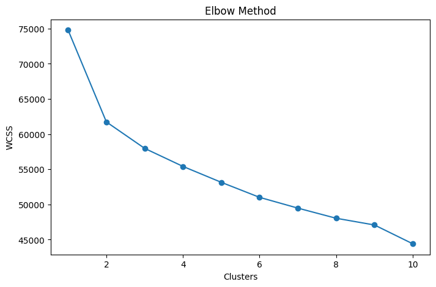
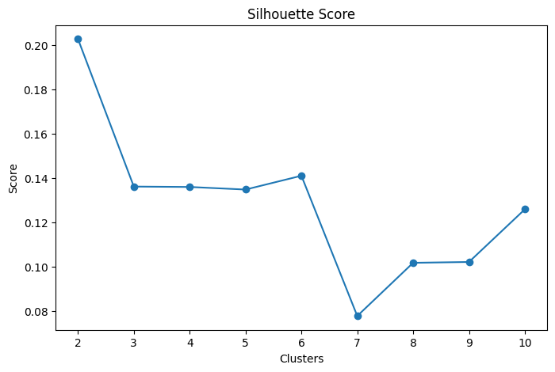
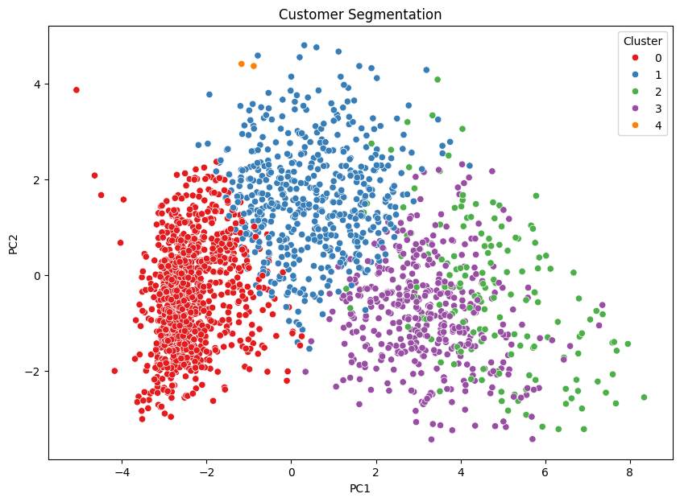

# Customer Segmentation Analysis using PCA & K-Means Clustering

## Project Overview

This project focuses on customer segmentation using unsupervised machine learning techniques. The primary objective is to identify distinct customer groups based on demographic information, purchasing behavior, and marketing campaign responses.

Principal Component Analysis (PCA) was applied for dimensionality reduction while preserving the maximum amount of information. K-Means Clustering was then used to segment customers into meaningful groups. The resulting customer segments were analyzed to develop business-oriented customer personas and actionable marketing strategies.

---

## Dashboard Preview



---

## Objectives

* Perform customer segmentation using unsupervised machine learning techniques.
* Apply Principal Component Analysis (PCA) for dimensionality reduction.
* Determine the optimal number of clusters using the Elbow Method and Silhouette Analysis.
* Segment customers using K-Means Clustering.
* Develop meaningful customer personas based on purchasing behavior.
* Generate business insights to support data-driven marketing decisions.

---

## Dataset

**Dataset:** Marketing Campaign Dataset

The dataset contains customer demographic information, purchasing behavior, spending patterns, and campaign responses.

### Key Features

* Income
* Age
* Education
* Marital Status
* Number of Children
* Recency
* Product Spending Categories
* Web Purchases
* Catalog Purchases
* Store Purchases
* Website Visits
* Campaign Responses

---

## Methodology

### 1. Data Preprocessing

* Handled missing values in the `Income` column.
* Removed unnecessary columns.
* Created the `Age` feature from `Year_Birth`.
* Created a `Total_Spending` feature.
* Applied One-Hot Encoding to categorical variables.

### 2. Feature Scaling

* Standardized numerical features using `StandardScaler`.

### 3. Principal Component Analysis (PCA)

* Applied PCA for dimensionality reduction.
* Preserved 95% cumulative variance.
* Reduced the feature space while retaining important information.

### 4. K-Means Clustering

* Determined the optimal number of clusters using:

  * Elbow Method
  * Silhouette Analysis
* Segmented customers into five distinct clusters.

### 5. Customer Persona Development

Analyzed customer segments based on:

* Income
* Spending behavior
* Purchase channels
* Product preferences
* Campaign responses

### 6. Data Visualization

Created visualizations to analyze:

* Customer Distribution by Cluster
* Average Income by Cluster
* Average Spending by Cluster
* PCA Cluster Visualization
* Customer Persona Analysis

---

## PCA Results

| Metric                  | Value |
| ----------------------- | ----- |
| Original Features       | 35    |
| PCA Components Retained | 27    |
| Variance Preserved      | 95%   |

---

## Customer Segments

### Cluster 0 – Low-Value Customers

* Lowest income segment.
* Minimal spending across all categories.
* Low purchasing activity.
* Suitable for engagement and retention campaigns.

### Cluster 1 – Budget-Conscious Customers

* Moderate income levels.
* Price-sensitive purchasing behavior.
* Responsive to discounts and promotional offers.

### Cluster 2 – Value-Oriented Customers

* Medium-to-high income levels.
* Consistent purchasing behavior.
* Strong potential for upselling and cross-selling.

### Cluster 3 – Premium Loyal Customers

* High income and spending patterns.
* Frequent purchases across multiple channels.
* Ideal candidates for loyalty programs.

### Cluster 4 – Elite High-Value Customers

* Highest income segment.
* Highest overall spending.
* Strong preference for premium products.
* Most valuable customer group.

---

## Customer Personas

| Cluster | Persona                    | Business Strategy                           |
| ------- | -------------------------- | ------------------------------------------- |
| 0       | Low-Value Customers        | Customer Retention Campaigns                |
| 1       | Budget-Conscious Customers | Discounts and Promotional Offers            |
| 2       | Value-Oriented Customers   | Cross-Selling and Upselling                 |
| 3       | Premium Loyal Customers    | Loyalty Programs and Personalized Marketing |
| 4       | Elite High-Value Customers | VIP Memberships and Premium Services        |

---

## Visualizations

### Elbow Method

Determined the optimal number of clusters for K-Means clustering.



---

### Silhouette Analysis

Evaluated clustering performance using Silhouette Score.



---

### PCA Cluster Visualization

Visualized customer segments using principal components.



---

## Business Insights

* Customer income strongly influences spending behavior.
* High-income customers contribute significantly more revenue.
* Premium and Elite customers represent the most profitable segments.
* Low-value customers require targeted engagement strategies.
* Customer segmentation enables personalized marketing and improves customer retention.

---

## Technologies Used

* Python
* Pandas
* NumPy
* Matplotlib
* Seaborn
* Scikit-learn
* Principal Component Analysis (PCA)
* K-Means Clustering
* Jupyter Notebook

---

## Project Structure

```text
Marketing_Campaign_Customer_Segmentation/

│
├── Customer_Segmentation.ipynb
├── marketing_campaign.csv
├── customer_segments.csv
├── cluster_profiles.csv
├── elbow_method.png
├── silhouette_score.png
├── pca_clusters.png
├── dashboard.png
├── requirements.txt
└── .gitignore
```

---

## Output Files

The project generates the following output files:

* `customer_segments.csv`
* `cluster_profiles.csv`
* `elbow_method.png`
* `silhouette_score.png`
* `pca_clusters.png`
* `dashboard.png`

---

## Conclusion

This project demonstrates the practical application of unsupervised machine learning techniques for customer segmentation. By combining PCA and K-Means clustering, meaningful customer groups were identified, enabling businesses to design targeted marketing strategies and improve customer relationship management.

---

## Author

**Aimash Waheed**

Data Science | Machine Learning | Data Analytics
